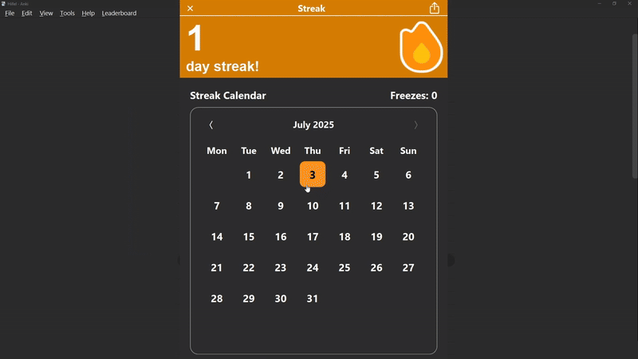
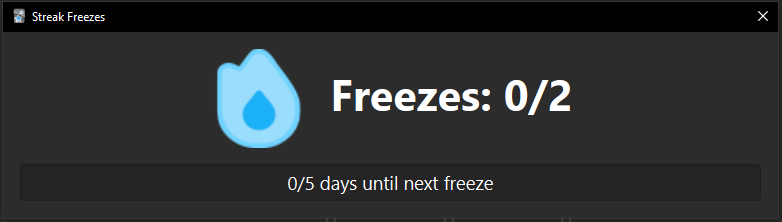
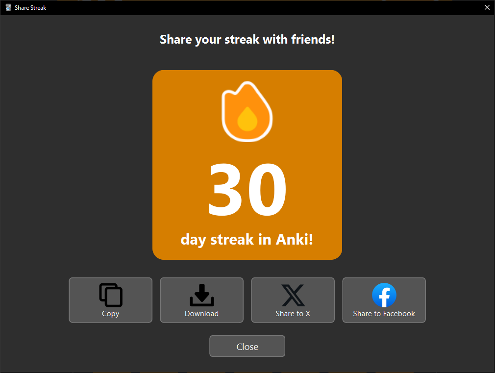

# AnkiStreak 

AnkiStreak is a motivational add-on for [Anki](https://apps.ankiweb.net/) that helps you build and maintain a consistent learning habit. Inspired by Duolingo's streak system, it rewards your progress with satisfying streak animations and visualizes your daily reviews through an interactive calendar.

## Features

**Daily Streak Counter** 
  - Shows your current streak
  - Click it to open the Streak Calendar
    

**Streak Calendar** 
  - A detailed calendar view of your entire streak history

**Streak Freezes** 
  - Automatically used on a day you forget to review
  -  Earn a new freeze for every 5 days reviewed

**Animations** 
  - Get a rewarding animation pop-up after your first review of the day.

**Share Your Progress** 
  - Copy, download, or share your streak with others.

## Installation

1. Download Anki and [create an account]((https://ankiweb.net/)) if you don't have one already.
2. Go to the [AnkiStreak](https://ankiweb.net/shared/info/392667675) page on [AnkiWeb Add-ons](https://ankiweb.net/shared/addons/).
3. Find the download code under the "Download" section.
4.  Open Anki on your desktop.
5.  Go to **Tools** -> **Add-ons**.
6.  Click **Get Add-ons...** and paste the code from AnkiWeb (`392667675`).
7.  Restart Anki.

## How It Works

*   The first time you run the add-on, it scans your entire Anki review history (`revlog`) to build a complete record of all past days you've studied. This history is stored in a local `streak_history.json` file within the add-on's folder and updated on Anki restarts and syncs.

*   **Streak Recalculation:**  The streak is recalculated whenever Anki syncs or resets. The logic works backward through each day, checking if:
    1.  The day has at least one review.
    2.  A streak freeze was automatically consumed that day.

*   **Event-Driven Updates:** The add-on uses Anki's built-in hooks to trigger actions.
    - `profile_did_open`: When you open your profile, the add-on loads your data and runs an initial streak calculation.
    - `reviewer_did_answer_card`: After you answer your first card of the day, your streak is updated, and the "streak maintained" animation is triggered. This is also when the counter for earning new freezes is incremented.
    - `sync_did_finish`: After a sync, the add-on re-evaluates your review count to include cards studied on other devices, updating progress towards the next streak freeze.

## Contributing

Contributions are welcome! If you have ideas for new features, bug fixes, or improvements, please feel free to open an issue or submit a pull request.

## Support

Any support is greatly appreciated and helps me continue development of AnkiStreak!

## License

This project is licensed under the [MIT LICENSE.](LICENSE)
